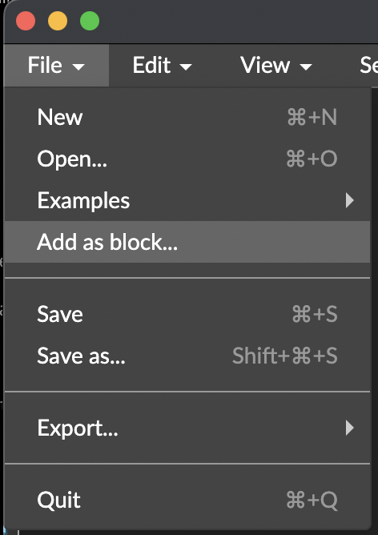
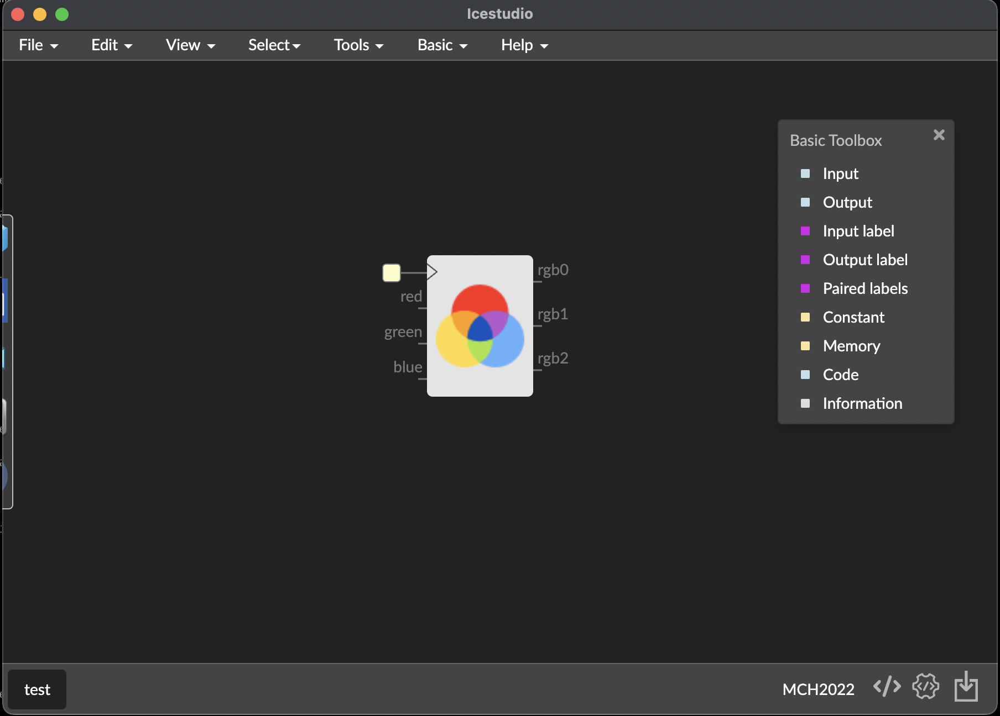
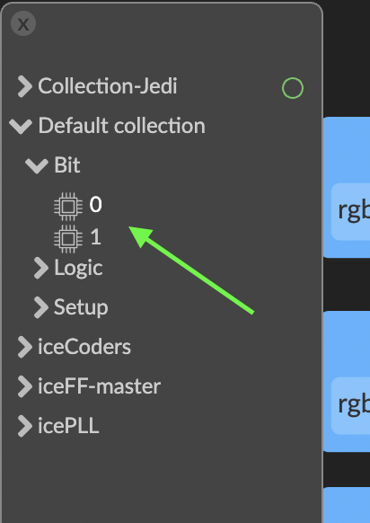
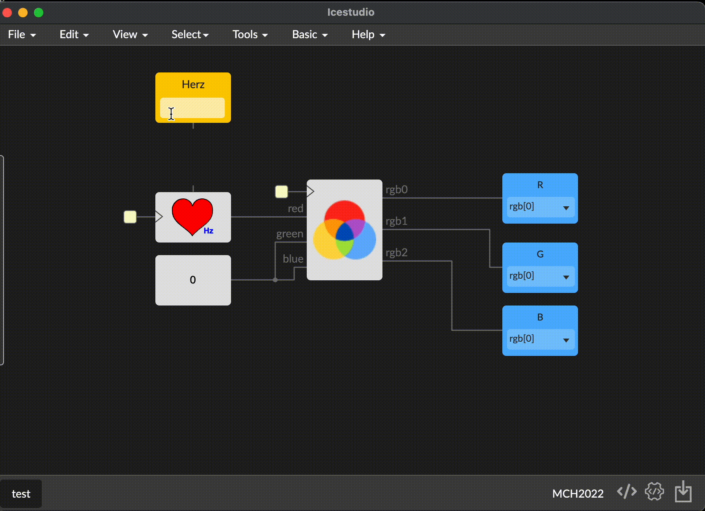

# Your first design

In this step, you learn the basis operations of Icestudio.

First of all, always start saving your new project, in this case we could call *test.ice*

When you saved it, you could view the name of your *top design* in the bottom left corner:

Now, we are going to learn to add external blocks that you could find in other websites or forums, or you could develop to reuse.

In this example we try to load the file **blocks/RGB.ice** of this repository, you only need to do *File / Add as block:

Once you do it, yo view that your mouse cursor has attached the block, you only need to click where you want to put.

This block controls the RGB led linked to the FPGA. As you can see, the block has 4 inputs and 3 outputs.

The first input appears with a yellow square. This first input is *the system clock*. This is an automatic route that with some internal configurations Icestudio do for you. In general you never needs to route the clock of your blocks.

Now we need to connect the core block to the physical fpga outputs for each RGB signal. You can add the pyhisical FPGA inputs and outputs with the *Basic menu*.  The *Basic menu* is callable from the top menu bar , option *Basic* or over the design canvas with the shortcut **CTRL+T** (in OSX **Cmd+T**)

If you access from the menu, **Basis options** appears as a dropdown menu, and if you use the shortcut, the **Basis menu** appears as a floating window:

In the **Basis options** select **Output** and then a dialog tell you for a name to this output, this is only informative, you could left blank. In our case we write **R** and continue:

You can view a new kind of block, as an output, has a connector in the left and a select box to select what physical FPGA output is, in this case we select **rgb[0]**

Then we could connect the **rgb0** output pin of the RGB block to the physical output:

Repeat the same operation with the others R, G, B signals:

At this moment you have connected your block with the physical RGB lef of your board...but if you try to build and upload, don't do nothing. Why? because the block needs the input RGB code to know what color do you like to display.

RGB led is a hardware component that has 3 bits (3 wires) as input to know where color display. In computer programming  when you want to define an RGB color, for example with 8 bits per color, you could define 256 levels for each color and the mix the three of this values you obtain the final color.

In hardware we could define this **range** of each color with one bit using techniques like pulse modulation (PWM) or similar.

In this example the objetive is not understand the pulse modulation that could be complex but i think it's important almos that sounds why the things works.

To generate easily a pulse modulation that turn on our led, we could use a block from the collection manager (remember we installed some collections in previously steps).

The block to use for this purpouse is the **Heart** block of the  Jedi collection, the next video shows the path to select. You only need to browse the component tree and click on it to put into the design:

In this way, now we have the red signal configured to emit a pulse at 1Hz, but we need to  setup G and B color values, for this test we set up 0 value to view only the red color component turned on.

To assign a 0 value we could use a block that emits a 0 signal from his output. There is a block in the default collection to do it:

As you seen in the next video you can assign the same output to multiple inputs:

### Now our design is operative

You can go to **Tools / Build** and when finish it **Tools / Upload** to push your bitstream into the FPGA of the MCH2022 badge and see it works!

## Block parameters

As you can see, the heart block has an input on top of the block, this is a parameter for the block to parametrize it.

In the heart block the parameter configure the frequenzy (in Hertzs) of the pulse generated.

To assign a value for this parameter you need to go to the **Basis menu** and select **Constant**

You could assign a name or left blank:

Then setting your value, for example 20Hz (veo pulses per second) and connect to the parameter input:

### Try it! change values of the heart frequenzy and remember always **Build** and then **Upload**

Finally remember you can zoon and move along the design (and enter into blocks with double click):

### :point_right: Continue to the next step, [interactivity](04_interactivity.md)