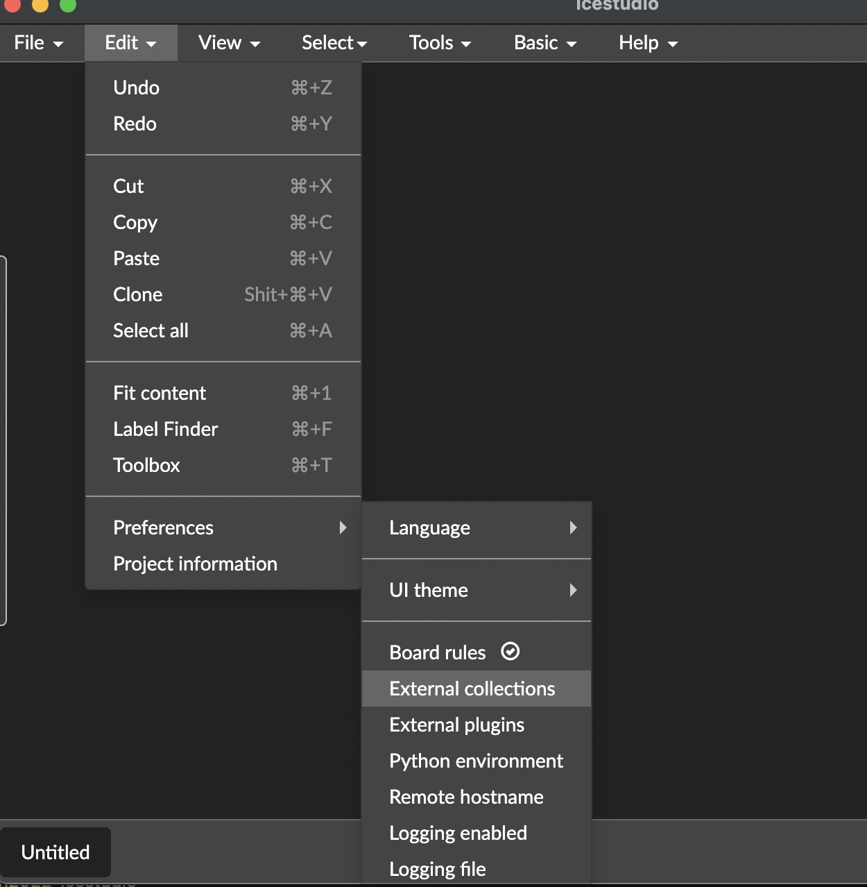
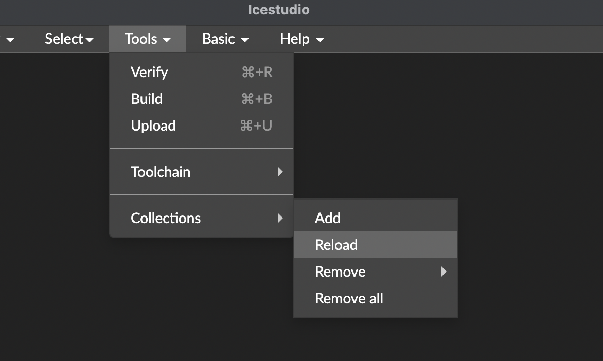
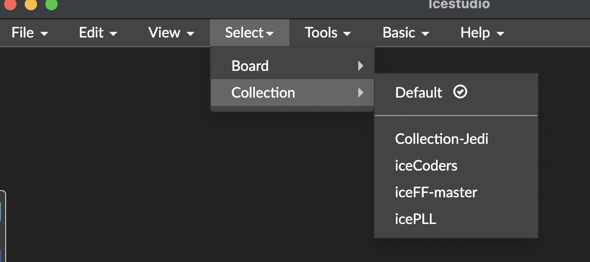
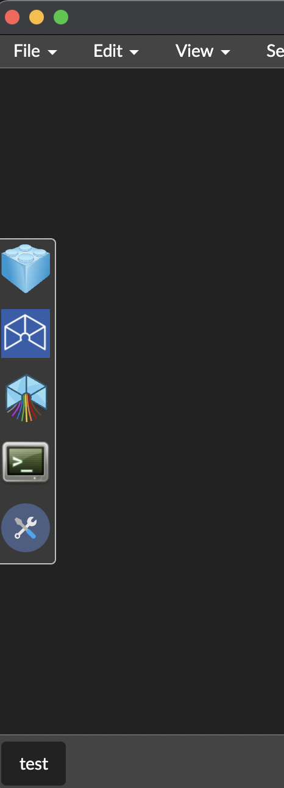
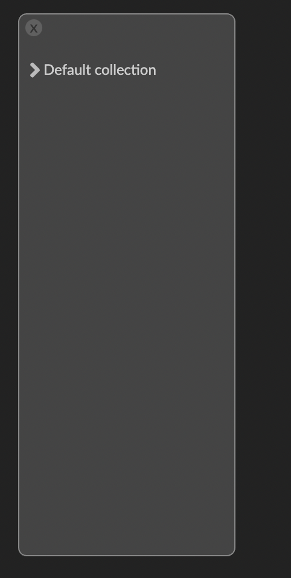
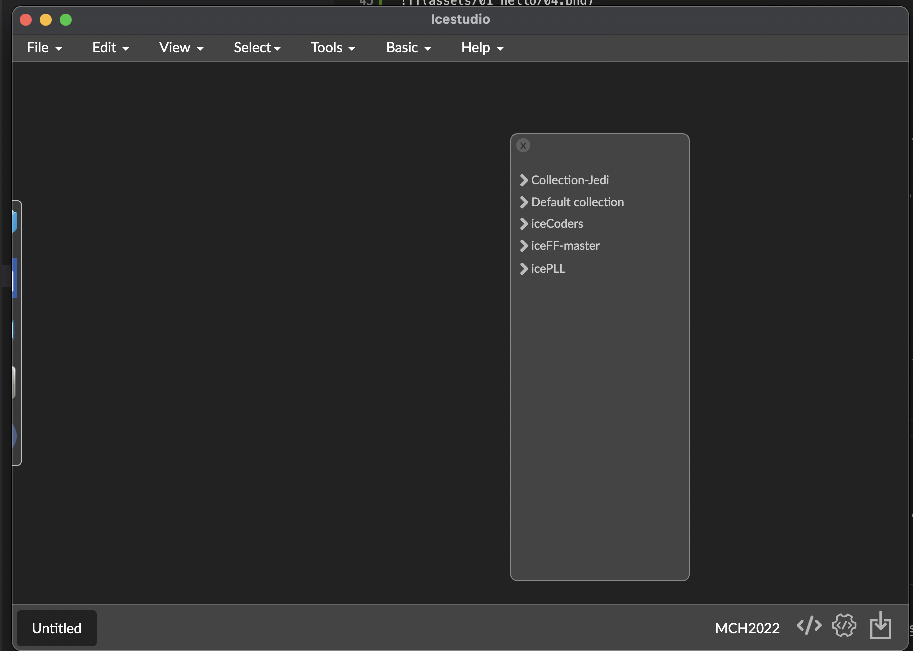

# Setup MCH2022!

Our first example, turn on the RGB led and explain the basic concepts of Icestudio.

Icestudio permits join **logical blocks** and translate it to an FPGA bitstream

Icestudio works with Verilog language inside and then, then blocks finally are Verilog code.

Advanced users could make their own blocks on verilog and encapsulate in an easy block to be used for other people or by himself.

Blocks could be grouped into **collections** that works like component libraries.

**But first we need to setup some things**

## Install collections

The first thing important to do is install some collections to start with useful blocks.

To do it, go to **edit/preferences/external collections**

In this option you should writte the complete path to the directory in wich you put the **collections**.

Then you need to go to **Tools / Collectiosn / Reload

To install collections you only need to **copy the directory of the collection to this directory** and **reload it**.

If all is OK, you could view your installed collections in **View / Collections**

The first collections do you need to install are:

* [Jedi Collection](https://github.com/FPGAwars/Collection-Jedi) a lot of components.
* [PLL Collection](https://github.com/FPGAwars/icePLL) blocks to manage PLL

Once installed and reload collections you can view something similar at:

Now you need to restart Icestudio. We are working in a living complete reload but in this moment you need to restart Icestudio when you install new collections.

## Knowing the environment

First of all **save** your empty design. This is important because Icestudio generate some files when generate the bitstream and in many cases you need to review something in it.

After save, we started the **Collection manager**. This is a manager for blocks. You only need to move your cursor at the left window border and a panel appears.

Then click on the first icon and this window appears:

If this is the first time you open the collection manager, could take time to load all hte blocks, when finish, you show the list of all loaded.

The next time all we be avabilable instantly.

## Other collections

Visit our [wiki page](https://github.com/FPGAwars/icestudio/wiki) that contais a lot wip collections.

### :point_right: Continue to the next step, [hello world](02_hello_world.md)
