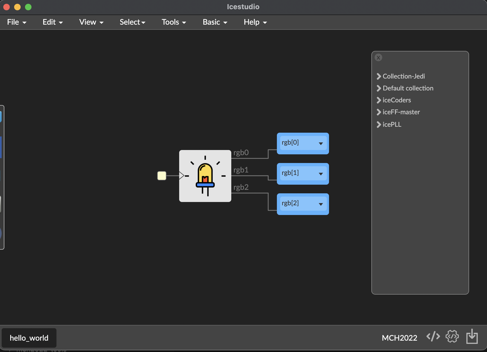
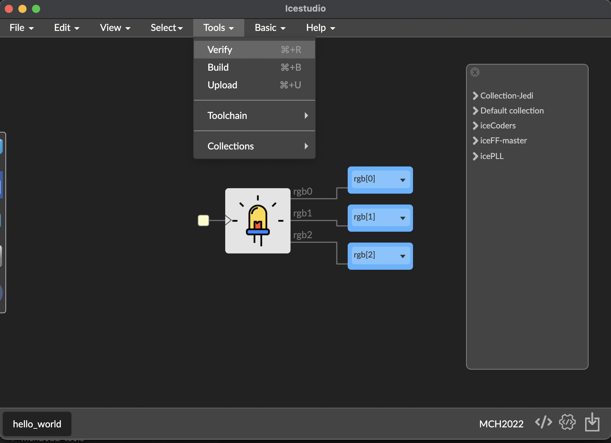
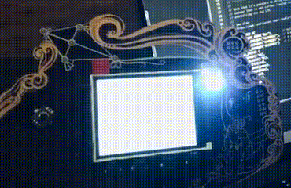

# Hello world

Open the first example, located in **examples** folder, named hello_world:

Go to menu **Tools / Verify**, and try **Build** and finally **Upload**:

Then you view your badge change to FPGA mode, loading the bitsream and working.

When the bitstream finish to load, the RGB led turns on and rotate its color.

You load your first FPGA design!