# Your first design

This chapter contains a more in depth description of basis Icestudio
operations.

Most importantly, always start saving your new project, in this case we'll call
it *test.ice*

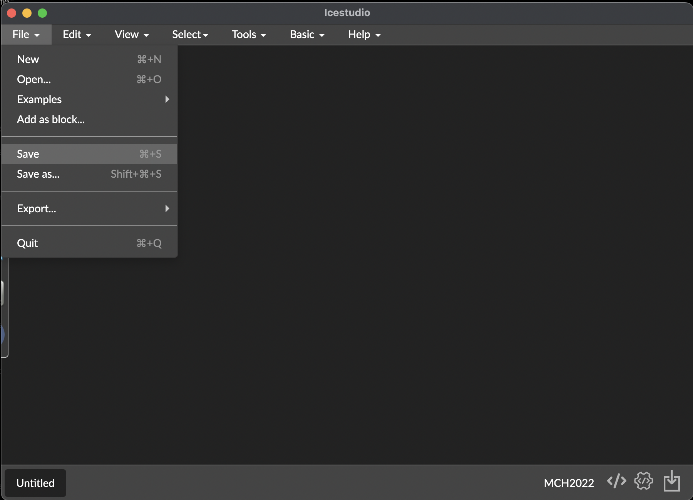

After you saved the project, view the name of your *top design* in the bottom
left corner:

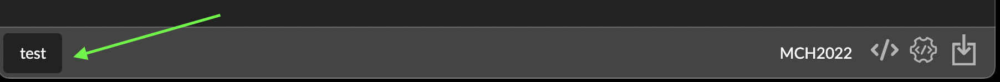

In the nexts steps we'll add some external blocks, you can develop and reuse
your own blocks, but you may also want to integrate som that you found on a
website or forum. We'll try to load the file **blocks/RGB.ice** from this
repository, use "Add as block..." from the *File* menu:

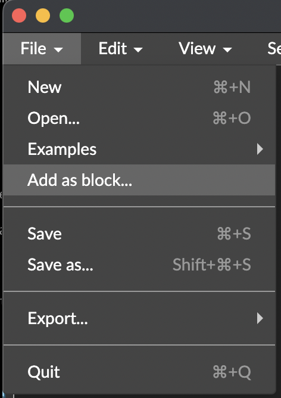

When the block is added, it's initially connected to the cursor, click to drop
the block at the proper location on the canvas.

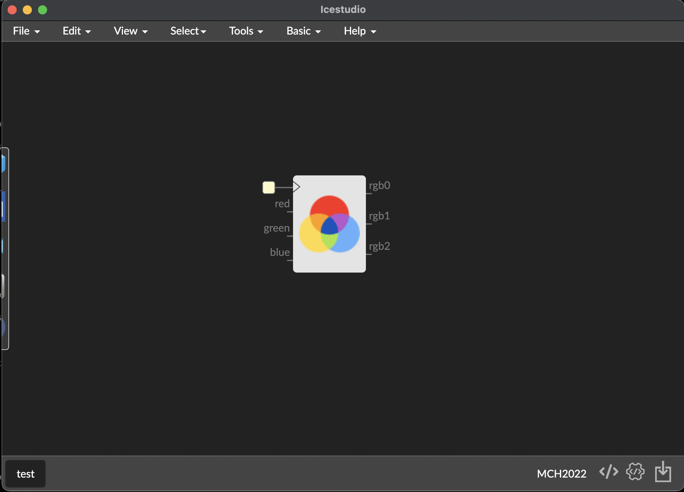

This block controls the RGB LED connected to the FPGA. As you can see, the block
has 4 inputs and 3 outputs.

The first input appears as a yellow square. This first input is *the system
clock*. This is an automatic route with configurations Icestudio did for you.
In general, you don't need to route the clock of your blocks.

Now we need to connect the core block to the physical FPGA outputs for each RGB
signal. You can add physical FPGA inputs and outputs in the *Basic
menu*.  The *Basic menu* is callable from the top menu bar, option *Basic* or
using the design canvas with the shortcut **CTRL+T** (in OSX **Cmd+T**)

If you access from the menu, **Basic options** appears as a dropdown menu, and
if you use the shortcut, the **Basic menu** appears as a floating window:

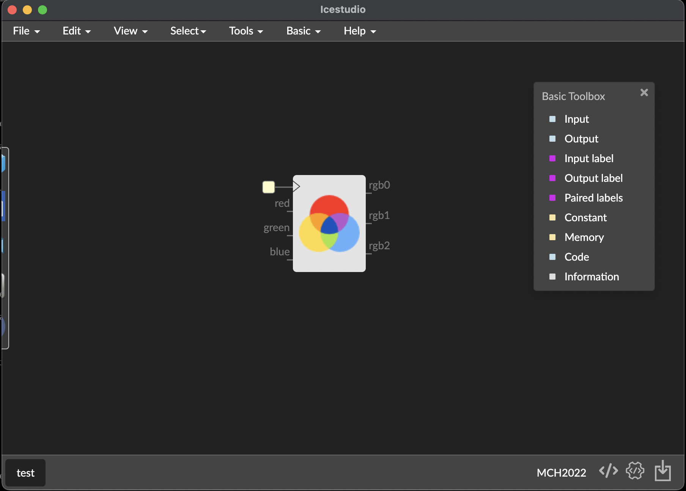

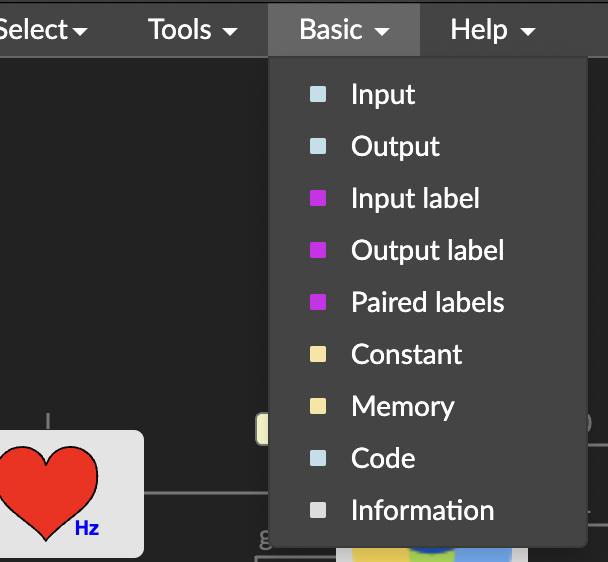

In the **Basic options** select **Output** and name the output in the dialog
that appears. This is only informative, and could be left blank. In our case we
write **R** and continue:

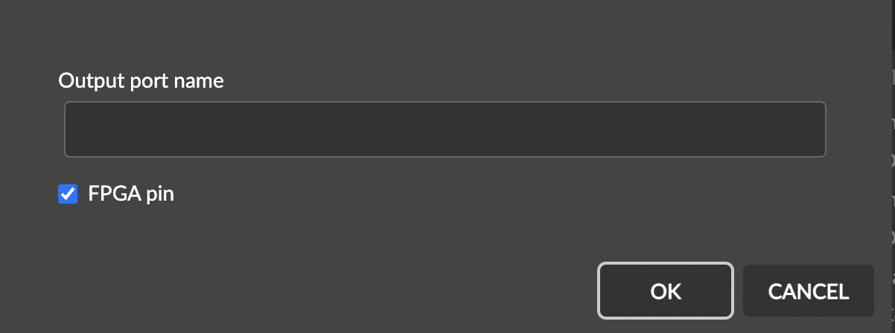

You'll now see your new block. It's an output, it has a collector on its left and contains a select box, which may be used to select the physical FPGA pin to connect it to. In our case, select **rgb[0]**

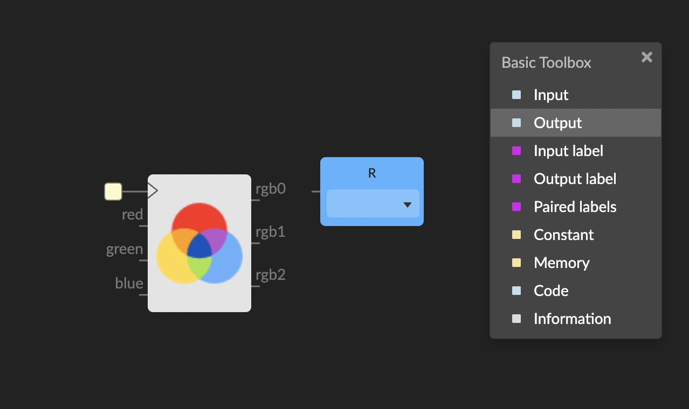
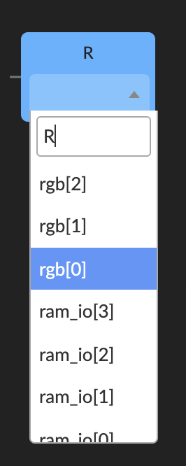

Now we are able to connect the **rgb0** output of the RGB block to the physical output:

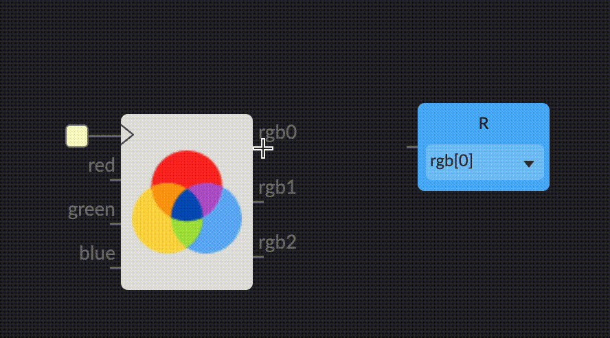

Repeat the same operation with the G and B signals:

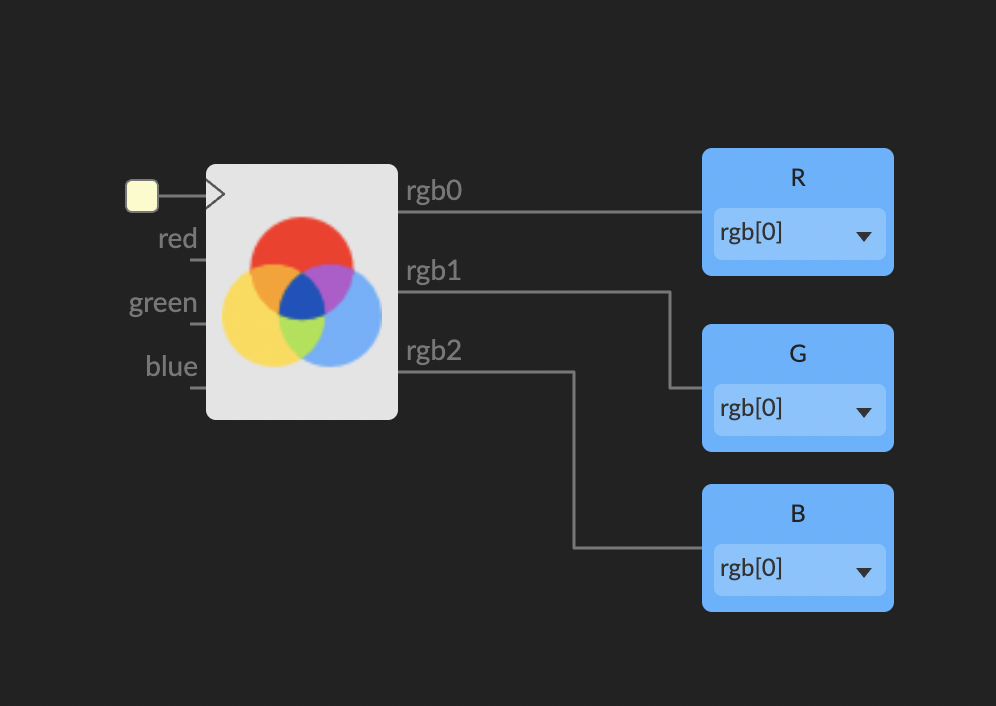

At this point  you have connected all outputs of your RGB block to the physical
RGB pins of your Badge... but if you try to build and upload, nothing happens.
Why? Because the RGB block needs some inputs to know what what color you would like
to display.

The RGB LED is a hardware component which has 3 bits (3 wires) as input
powering a tiny R B or G LED. It's just three different LEDs in a single
package. But on the computer programming side of things you define an RGB color using 24 bits,using 8 bits per color. You can define 256 levels for each color and
mix the three individual values to obtain the final color.

In hardware each of the three LEDs are either on or off, but we can simulate
the 256 brightness levels using a technique called *pulse width modulation*
(PWM). This works by turning an LED which is only supposed to be half as bright
on only half of the time. If you turn the LED on and off quickly enough, no one
will be able to tell the difference.

To easily generate a PWM to drive the LED, we will use a block from the
collection manager (remember we installed some collections in previous
steps).

The block to use for this purpose is the **Heart** from the Jedi collection,
the video below shows how to select it. You only need to browse the component
tree and click on it to put into the design:

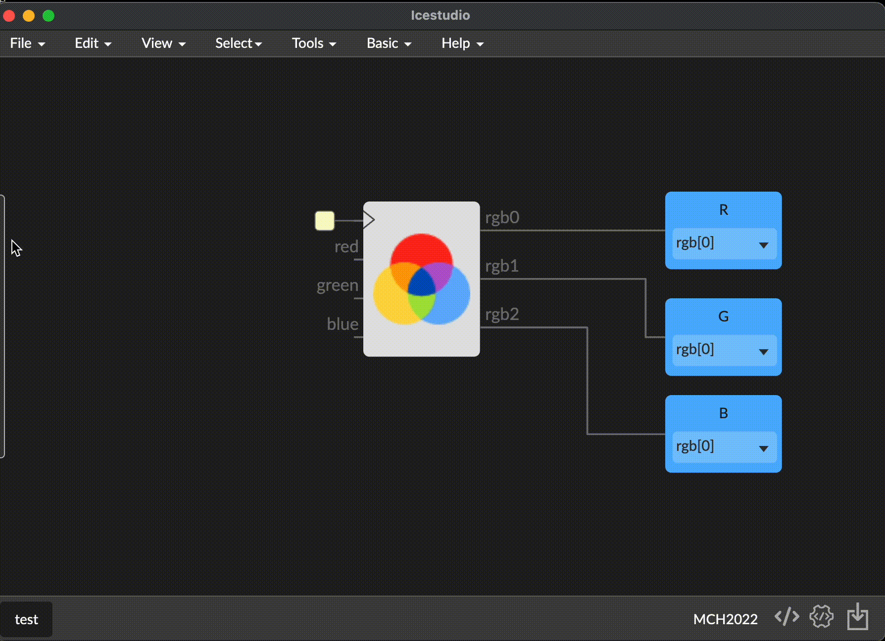

Having done this, you now have a red signal configured to emit a pulse at 1Hz.
But we still need need to  set up G and B color values. For testing we'll set
up 0 values. Of course this means only the red color component will be turned
on.

We'll assign a 0 value using a block that emits a 0 signal from his output.
The default collection contains a block for this:

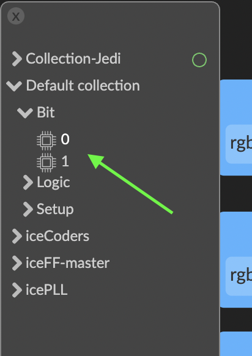

The same output can be connected to multiple inputs. Note that this does NOT
work the other way around, connecting the output of multiple blocks to a single
input does not make sende.

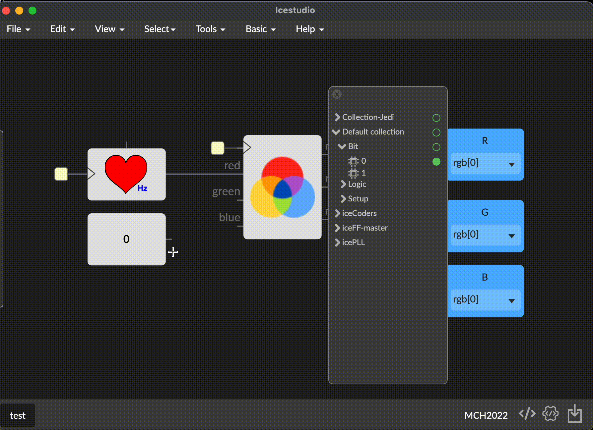

### Now our Design is Operative! `\\o/`

Go to **Tools / Build** and when finished call **Tools / Upload** to push your
bitstream into the FPGA of the MCH2022 badge and see it work!

## Block parameters

As you can see, the heart block has an input on top. You can use it to
parametrize the block.  In the heart block the parameter configures the
frequenzy (in Hertz) of the generated pulse.

To assign a value for this parameter you need to go to the **Basic menu** and
select **Constant**

You could assign a name or leave it blank:

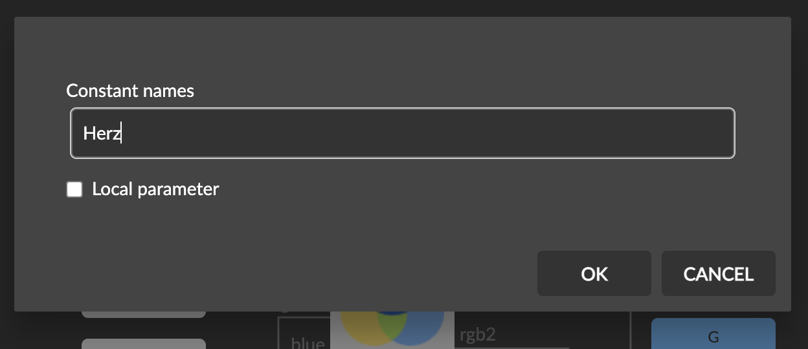

Finally, set your value, for example 20Hz (pulses per second) and connect the
constant output to the parameter input:

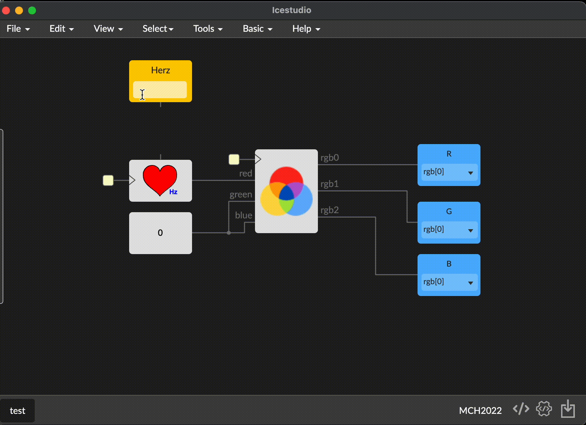

### Try it! change values of the heart frequenzy and remember always **Build**
and then **Upload**

Finally remember you can zoon and move around the design (and enter into blocks
with double click):

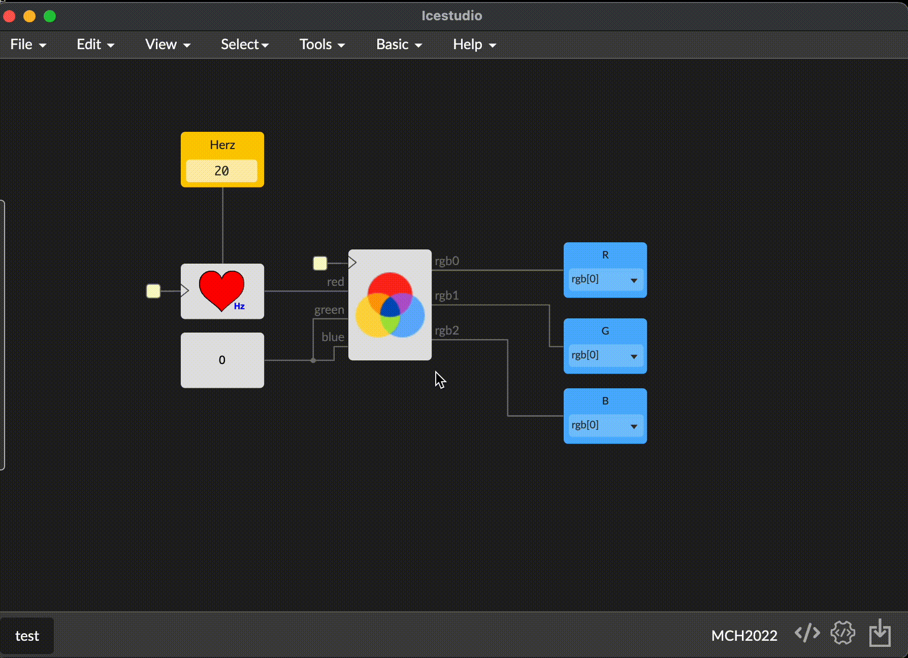

### :point_right: Continue to the next step, [interactivity](04_interactivity.md)
