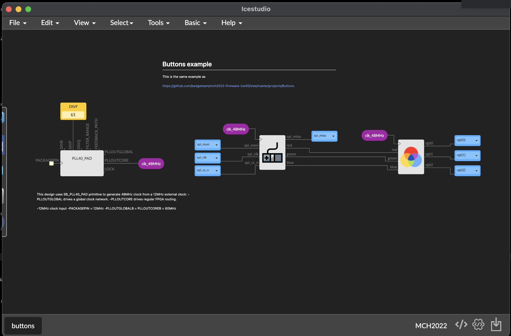
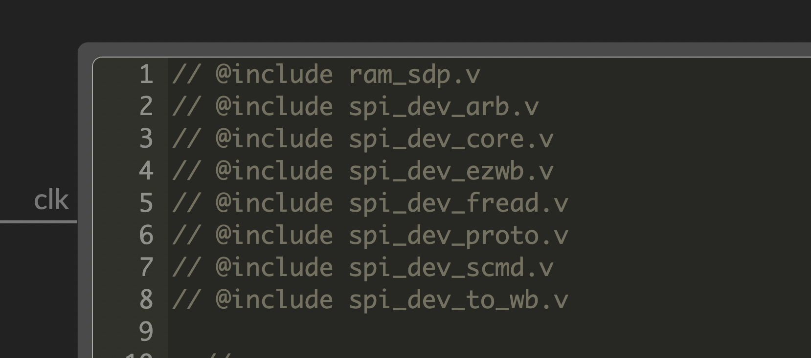
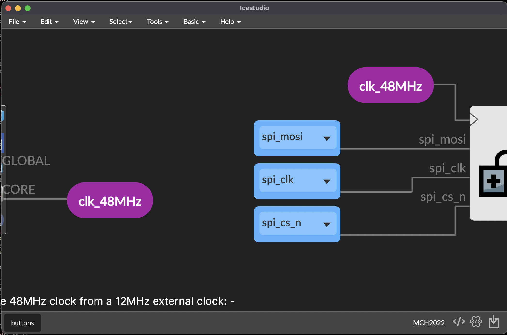
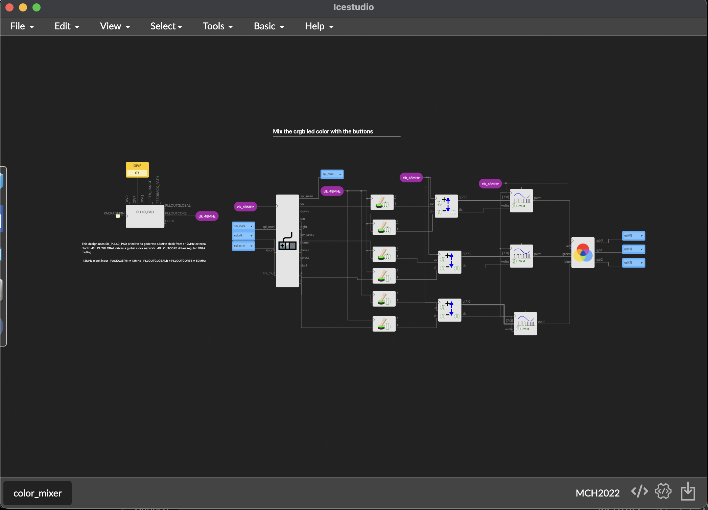

# Interactivity

While the FPGA could operate on its own, it's more fun to interact with all the other peripherals on the board and with other computers...

For example, a logical thing to do is interact with the buttons to allow for
user interaction.  

The buttons in the MCH2022 Badge are connected to the RP2040 chip which
forwards clicks to ESP32 processor. The ESP in turn forwards clicks to the
FPGA.  So, while it might sound strange, this is hte reason you need to
communicate with the buttons via SPI.

Icestudio tries to simplify development by packing all these details into
button *blocks* so you can access them easily and not have to worry about
architecture craziness..

Open the example **buttons.ice** and try it! It's the same example contained in
[https://github.com/badgeteam/mch2022-firmware-ice40/tree/master/projects/Buttons](https://github.com/badgeteam/mch2022-firmware-ice40/tree/master/projects/Buttons)
but implemented with Icestudio blocks instead of Verilog.

After **Build** and **Upload** you cand push the Badge's buttons and see how
the RGB LED lights up in different colors.

This example demonstrates a number of new concepts:

## Imported Verilog files

The same directory containing the loaded `.ice` file contains Verilog
source files. The button blocks you use are only a wrapper around the
Verilog source code which uses an SPI core to access the buttons.

You can import Verilog files by adding `@include` directives in comments
within code blocks:

## Labeled Connections

Use the **basis menu** to insert **label input** and **label output**.
These represent a **virtual cable** that connects labels with the same
name.

This feature helps to simplify the design layout by reducing the tangle
of wires.

The next example, **color_mixer** goes one step furth, this time using the
generic buttons block. This example allows you to change the value of R,G and
B color channels by pressing the buttons:

* Red, up and down
* Green, left and right
* Blue, A and B

Try it, change some of the connection and experiment with results. Have
fun!

### :point_right: Continue to the next step, [outside communications](05_outside_communications.md)
