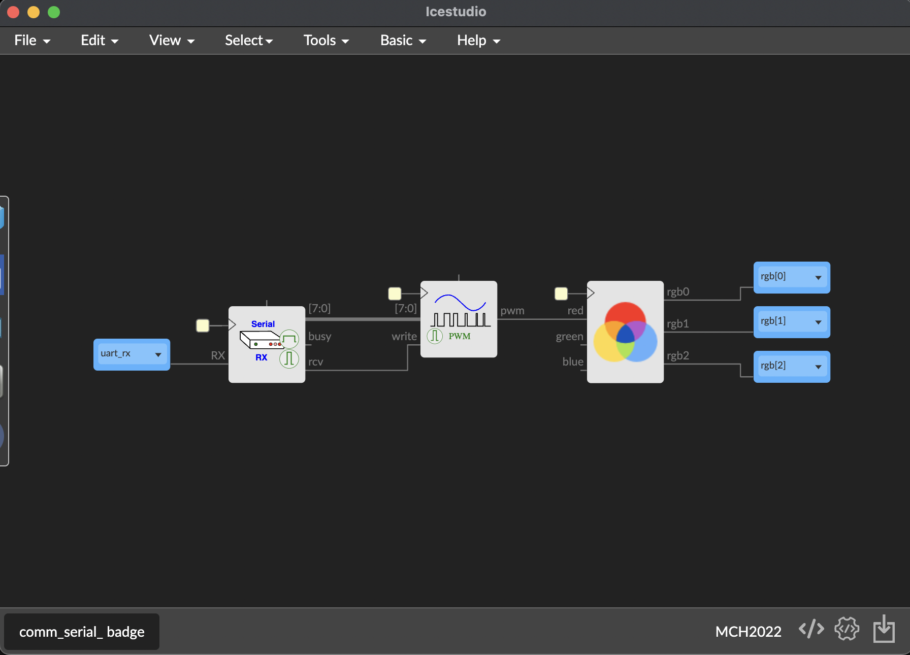
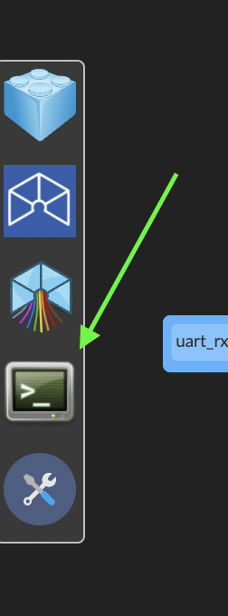
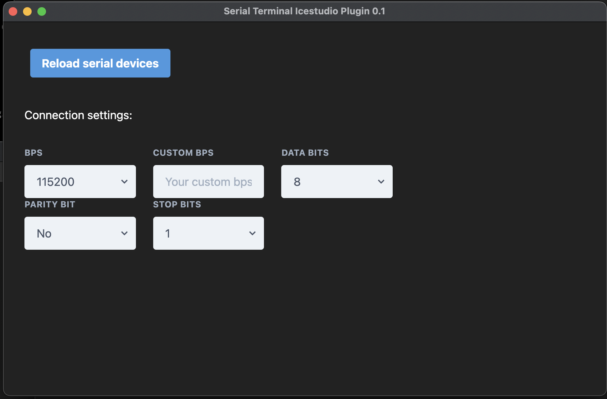
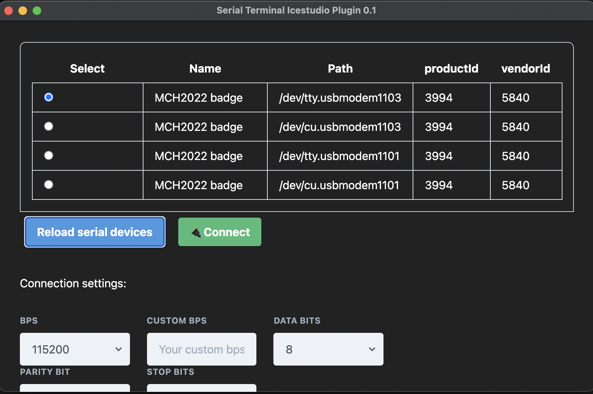
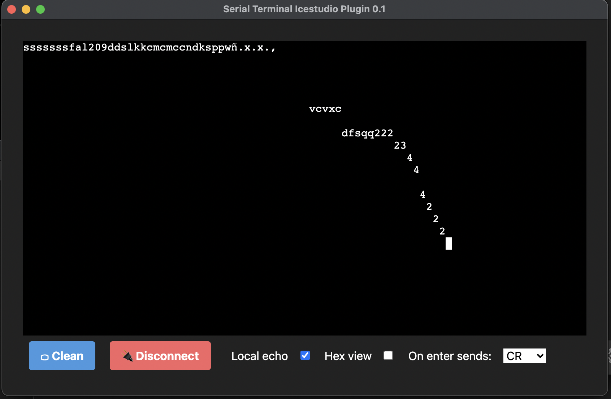
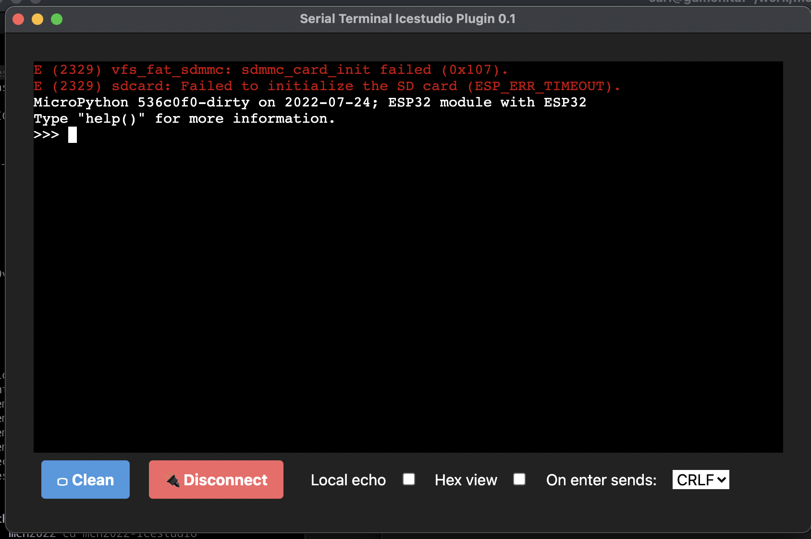

# Outside communications

The FPGA is not alone, in fact its power is collaborating with other chips or computers.

Simple way to connect with your computer is across usb with the serial port that the badge support throught the UART.

Icestudio  has a serial terminal that you could use to communicate with your badge.

Load the comm_serial_badge example. This example reads the keyboard from the serial terminal, and sets de ASCII character value as a level of RED color at the RGB led.

To try it, **Build** and **Upload** the example, and then, open the serial terminal of Icestudio (or each serial terminal you want).

Click on **reload serial devices** to scan for available uarts.

Select the uart corresponding to the badge FPGA and connect.

Write as you want in the terminal and show the color of your RGB led.

Of course, you could use Icestudio serial terminal to connect with micropython terminal shell of your badge:

