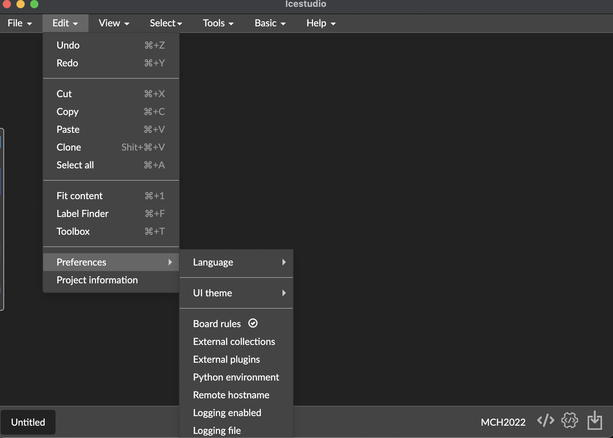

# Installation

Install Icestudio is very easy, you only need to download your OS package from:

https://downloads.icestudio.io

### Some tips

* For Linux users, take the **zip** package because **appImage** format has security problems with the badge usb subsystem (we are working to fix it).

* Linux zip packages contain ** a second zip package **, unzip again. This is generated by github artifacts packager and is a little confused.

* You need to setup first  your MCH2022Badge, [here the installation guide](https://badge.team/docs/badges/mch2022/getting-started/).

* In each case you need to have installed Python 3 in your system and in your PATH.

## Setup

Launch your binary and Icestudio start.

The first you view is the startup screen.

At the first start you need to select your board, in this case MCH2022:

The next step consist in install the APIO toolchain. This is a very easy step, you only need to click in the right bottom toaster tip:

APIO is a compiled and packaged version of Yosys toolchain, you dont need to fight with compilations or complex setups.

Once toolchain installation is finished, you are ready to do your first design.

If you want to modify configuration of Icestudio, you could find in **edit / preferences** :

### :point_right: Continue to the next step, [our first design](01_hello_world.md)

## Useful references

*[Official repository](https://github.com/FPGAwars/icestudio)
*[Official documentation, is a working process doc](https://github.com/FPGAwars/icestudio/wiki/Installation)